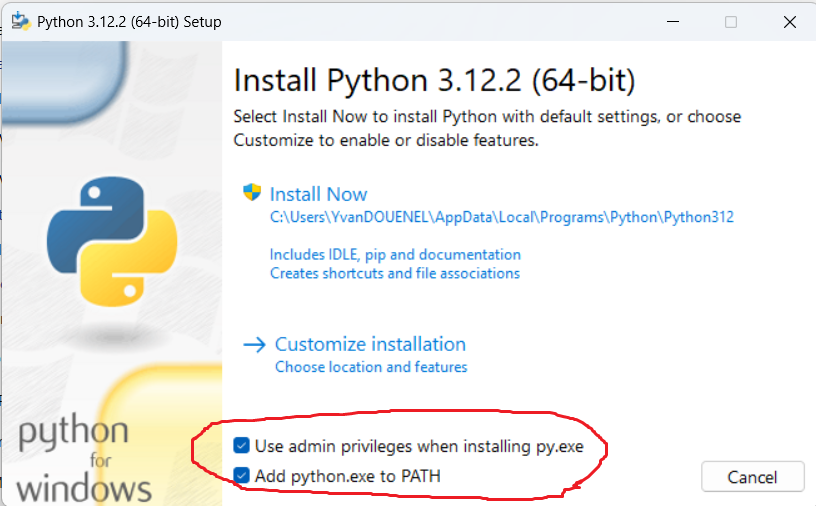
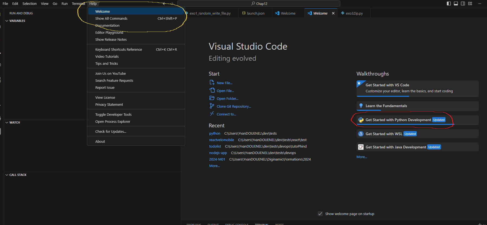

## Installation de python

---

- Se rendre sur [python.org](https://www.python.org), cliquez sur l'onglet **Downloads** et télécharger la version dernière version de **python 3.11**
- Ouvrir l'exécutable et dès le premier écran, **cocher la case "Add Python 3.x to PATH"**, afin d'inscrire python dans vos variables d'environnement.  
  
- Cliquez sur "Customize Installation".
- S'assurer que toutes les cases sont cochées et cliquer sur "Next".
- Cocher la case "Install for all users" et laisser les autres options comme telles.
- Accepter l'installation.
- À la fin de l'installation cliquer sur "Disable path length limit", et accepter comme auparavant.
- Fermez la fenêtre finale et ouvrez une invite de commande.
- Tapez `python` ou `py` et appuyer sur entrée.
- Si votre terminal vous donne accès à un interpréteur python votre installation est complète. Vous pouvez taper `exit()` pour sortir de l'interpréteur.  
  

Tester la version python

| Windows | MAC & Linux |
|---------|-------------|
| `python --version` | `python3 --version` |

### Environnement

Une bonne pratique consiste à utiliser un environnement virtuel spécifique au projet. Une fois que vous avez activé cet environnement, tous les packages que vous installez sont isolés des autres environnements, y compris l'environnement global de l'interpréteur, réduisant ainsi de nombreuses complications pouvant survenir en cas de conflits de versions de package.

<br>

## Installation de git bash

---

- Se rendre sur [le site de git bash](https://git-scm.com/downloads) et télécharger la version windows.
- Laisser toutes les options par défaut et cliquer sur `Next` à chaque écran jusqu'à la fin de l'installation

<br>

## Installation de VSCode et configuration pour python

---

- [Télécharger VsCode](https://code.visualstudio.com).
- Procéder à l'installation et laisser les options par défaut.
- Une fois dans VsCode, se rendre dans l'onglet extensions et taper "python" dans la barre de recherche.
- Installer la première extension suggérée.
- Créer un fichier python (.py), et taper `print('Coucou')` et sauvegarder le fichier avec `Ctrl + S`
- Cliquer sur l'icône triangle pour exécuter votre script.

### Pour aller plus loin avec VSC

FORMATER le code : L'utilisation de [Black Formatter](https://marketplace.visualstudio.com/items?itemName=ms-python.black-formatter) est recommandée

Se rendre sur le fichier settings.json et ajouter (Attention à préserver la syntaxe JSON) :

```json
"[python]": {
    "editor.defaultFormatter": "ms-python.black-formatter",
    "editor.formatOnSave": true
  }
```

PROJET Python
Se rendre sur la page d'accueil de VSC et dérouler le processus d'installation d'un projet Python  
  

Pour le mode "debug", il faut créer au moins un point d'arrêt (à gauche d'une ligne de code) et cliquer sur la flèche verte afin de voir les valeurs des variables (entre autres) sur la gauche de la fenêtre.  
  

## Installation d'Obsidian

---

- Télécharger [Obsidian](https://obsidian.md) et installez-le normalement sur votre PC.
- Une fois Obsidian ouvert, créer un coffre à l'emplacement de votre choix.
- Cliquer sur l'icône "engrenage" en bas à gauche de l'écran et aller sur l'onglet "Plugins de la communauté".
- Turn off le "Restricted mode"  
  
- Installer les plugins suivants :
  - Execute Code
  - Editor Syntax Highlight
- N'oubliez pas de les activer une fois installés
- Créer un nouveau dossier "Python" dans votre coffre.

<br>

### Clone du cours dans le coffre

- Ouvrir un terminal et se mettre dans le dossier Python nouvellement créé.
- Effectuer un `git clone` avec l'URL vers un repo GitHub que je vous donnerai. C'est par ce repository que je vous enverrai les cours et les exercices.
